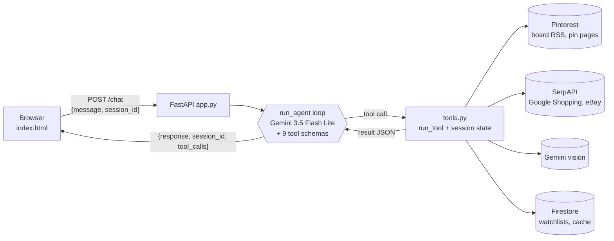

# Thriftboard

**Your Pinterest board, found secondhand.**

Thriftboard is a chat agent for people who save outfits on Pinterest and shop secondhand. Paste a public board (or a single pin) and it reads your style, turns the outfits into concrete pieces, finds them on Depop, Poshmark, Mercari, Etsy and eBay, tells you which prices are actually good, and plans what to buy so your budget recreates as much of your board as possible.

**Live app:** https://thriftboard-git-oxsetln23a-ew.a.run.app (sign in with a Columbia account)

Built on the course's `gemini-web-tool-calling` starter: a hand-written tool-calling loop over Gemini, behind FastAPI, deployed to Cloud Run.

---

## Why

Secondhand shopping from a mood board is slow, manual work. You look at a pin, guess what each piece is called, search five resale sites one by one, can't tell whether $35 is a good price, and check again every day in case something new was listed. Thriftboard does the translating, searching, pricing and checking for you, and it starts from the thing you already made: your board.

## Try it

Open the live app, then send these in order **in the same chat** (each builds on the last):

| # | Send this | What should happen |
| --- | --- | --- |
| 1 | `Here's my board: https://pin.it/15mMn5ekW. What's my style?` | Reads the board's pins, names the style ("cozy academic fall…"), shows the color palette, a numbered pin grid, and a numbered list of pieces. Calls `read_pinterest_board`. |
| 2 | `I have $100 and I already own brown knee high boots. What should I buy first?` | Opens with a headline like "$41 of your $100 recreates 10 of the 22 outfits on this board", then the actual listings to buy (photo, price, site, match score) and the next best buy. Calls `board_unlock`. |
| 3 | `Recreate pin 9 for me. Is each pick a good deal?` | Finds each piece in pin 9 secondhand, skips the boots you said you own, shows the pin next to the picks with match scores and an outfit total, then labels each price a steal, fair, or overpriced. Calls `shop_the_pin`, then `price_verdict`. |

More to try:

- `Find piece 4 under $30 in size S` → real listings as cards (`search_listings`)
- `Which of those fits my board best?` → photo-based match scores (`style_match`)
- `Watch L2 for price drops, and watch the skirt for anything new under $15` → (`watch_item`)
- `What's new on my watchlist?` → new listings, price drops, sold-out listings (`check_watchlist`)
- Paste any single pin link, e.g. `https://www.pinterest.com/pin/1093882197027642046/` → recreates that outfit with no board needed

Every reply has a small **"▸ N tool calls"** toggle under it that opens the exact tool calls, arguments and results.

## Tools

The agent has 9 tools. Five are original to this project (★), and five call external data (⇄).

| Tool | What it does | Data |
| --- | --- | --- |
| ★ `read_pinterest_board` | Reads a public board's latest 25 pins and has Gemini (vision) name the style, the palette, and every piece worth hunting for. Each piece gets a specific search query, a broader fallback query, and the list of pins it appears in. | ⇄ Pinterest RSS + Gemini |
| `search_listings` | Searches live used listings for one piece, with an optional max price and size. Returns up to 8 listings with short ids (`L1`, `L2`…) and a price summary across every result scanned. | ⇄ SerpAPI (Google Shopping, eBay) |
| ★ `price_verdict` | Ranks a price against every comparable listing (not just the 8 shown) and calls it a **steal** (cheapest quarter), **fair**, or **overpriced** (priciest quarter), with the median and typical range. Works on listing ids or on a price the user found elsewhere. | ⇄ SerpAPI (cached) |
| ★ `style_match` | Shows Gemini the listing photos next to the board's style and the original pin, and scores each 0–100 on silhouette, fabric, color and vibe, with a one-line reason. | Gemini |
| ★ `shop_the_pin` | Recreates one pin's whole outfit: searches each piece in parallel, then [value-picks](#how-picks-are-made) a real listing per piece against the pin's photo, and totals the outfit against typical secondhand prices. Takes a pin number or a pasted pin link. | ⇄ SerpAPI + Gemini |
| ★ `board_unlock` | Budget planner. A pin counts as "recreated" once you have all its garments. For the pieces that appear in the most pins it value-picks a real listing, then tries every combination of those listings to find the one that recreates the most outfits within budget (ties go to the cheaper plan), plus the single best next buy. | ⇄ SerpAPI + Gemini |
| `watch_item` | Watches either a **search** (new listings under a target price) or **specific listings** (price drops, sold out). Stores only what it needs to tell "new" from "seen". | Firestore |
| `check_watchlist` | Re-checks everything watched and reports new listings under target, price drops, and listings that disappeared (may have sold). | Firestore + SerpAPI |
| `unwatch_item` | Removes things from the watchlist. | Firestore |

### How picks are made

`shop_the_pin` and `board_unlock` recommend real listings you can click, not price estimates. For each piece:

1. **Shortlist** the 3 most relevant results plus the 3 cheapest (among the top 15). The cheapest alone are often the wrong garment; the most relevant alone miss the deals.
2. **Score** every shortlisted photo 0–100 against the board (and the pin, when recreating one) in a single Gemini vision call. Kids' items and different garments score below 50.
3. **Pick by value, in code:** among listings within 10 points of the best match (and at least 60), the cheapest wins. If nothing scores 60, the piece is reported as "no close match" rather than filled with a bad one.

`board_unlock` then optimizes over those actual prices, so "$55 recreates 6 of 20 outfits" means six listings that exist right now add up to $55.

### How the tools are designed

Following the course's guidance on writing tools:

- **Descriptions say when to call each tool**, and the system prompt repeats when (and when not) to use each one.
- **Enums over free text** where choices are fixed: `source` is `marketplaces | ebay`, verdicts are `steal | fair | overpriced`, piece categories are a closed set.
- **Known state never goes through the model.** The harness keeps a per-session scratchpad (last board read, last listings shown, pieces the user owns, session id) and passes it to every tool. The model says `L3`, never a 200-character listing URL; `watch_item` never asks the model for a user id; once you say you own the boots, `shop_the_pin` skips them on its own.
- **Steps that always run together are one tool.** `read_pinterest_board` fetches the feed, upgrades the images and runs the vision call; `shop_the_pin` searches, picks and totals.
- **Focused results.** Tools return trimmed JSON (top 8 listings, only the fields the model needs), not raw API responses.
- **Numbers the model must repeat come pre-computed.** `board_unlock` returns a ready `headline` and explicitly named counts (`outfits_recreated`, `outfits_on_board`), after an early version let the model misread a count and contradict its own card.
- **One slow search can't sink an answer.** Multi-piece tools search in parallel with a short timeout and one retry per piece; a piece that still fails is skipped and named, and the rest of the answer goes through.
- **Errors are JSON that tell the model what to do next**, never stack traces: *"That is a profile, not a board. Ask the user which board to use: pinterest.com/<user>/<board>/"*, *"No secondhand listings for X. Retry with a shorter, broader query"*, *"The search is running slowly. Tell the user to ask again in a few seconds; the retry is usually instant."*
- **Constrained output from the vision calls.** Every Gemini vision call uses a Pydantic schema as `response_format`, so the result is always valid JSON in the expected shape.

## How it works



1. **The harness** (`run_agent` in `app.py`) is the loop from class. It sends the conversation and the tool schemas to Gemini, runs any tools the model asks for, appends the results, and repeats until the model answers in plain text (at most 8 tool rounds per message).
2. **Memory.** Each session's full message history and tool state are kept in memory, keyed by `session_id`, and saved (compressed) to Firestore after every turn. Cloud Run stops idle instances and can run several at once, so a conversation picked up after a pause, or on another instance, still remembers the board. The browser stores the id; separate browsers get separate sessions, and "New chat" deletes the old one.
3. **The response** keeps the starter's shape: `response`, `session_id`, and `tool_calls` with the `name`, `args` and `result` of every call. The frontend turns tool results into visuals (pin grid, listing cards, outfit view, coverage meter, watchlist) and shows the raw calls in the collapsible trace.
4. **Persistence.** Watchlists live in Firestore under the session id, so they survive server restarts. Board reads (24 h) and searches (6 h) are cached in memory and in Firestore, which keeps a board reading the same way on every visit and saves search quota.

## Run it locally

Prerequisites: [uv](https://docs.astral.sh/uv/), the gcloud CLI, a GCP project with the Agent Platform (Vertex AI) API and Firestore (Native mode) enabled, and a free [SerpAPI](https://serpapi.com) key.

```bash
gcloud auth application-default login
echo "SERPAPI_KEY=your-key" > .env
uv run app.py
```

Then open http://localhost:8000. The app uses your gcloud default project for Gemini and Firestore.

## Deploy

The app deploys to Cloud Run with continuous deployment from GitHub (Developer Connect), using a Python buildpack with the entrypoint:

```
uvicorn app:app --host 0.0.0.0 --port $PORT
```

Every push to `main` builds and deploys. The SerpAPI key is stored in Secret Manager as `serpapi-key` and exposed to the service as the `SERPAPI_KEY` environment variable. The service's runtime account needs access to Vertex AI, Firestore, and that secret. Access is restricted to Columbia accounts with Identity-Aware Proxy.

## Project structure

```
app.py           Harness: system prompt, run_agent loop, sessions, /chat and /clear endpoints
tools.py         The 9 tools, their JSON schemas (TOOLS), and run_tool
index.html       The whole frontend: chat, pin grid, listing cards, outfit and coverage views
pyproject.toml   Dependencies (uv.lock pins exact versions)
submission.json  Deploy URL and authors
```

## Limits

- **Public boards only**, and only the **latest ~25 pins**: that's all Pinterest's public board feed returns. Making a fresh board of the looks you're hunting for right now works best.
- **Search coverage.** Google Shopping covers many Depop, Poshmark, Mercari, Etsy and eBay listings, but not all of them. Its links open Google's product page, which links on to the seller; eBay results link straight to the listing.
- **Search quota.** SerpAPI's free tier is 250 searches a month. Caching keeps repeat questions free; if the quota runs out, the agent says so and can still read boards.
- **No push notifications.** The watchlist updates when you ask "what's new on my watchlist?", not in the background.
- **Vision is a judgment call.** Piece names, match scores and outfit picks come from Gemini looking at photos. They are usually right, and occasionally a near miss.
